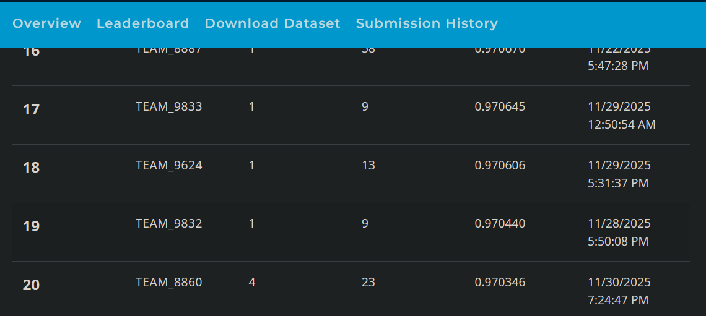
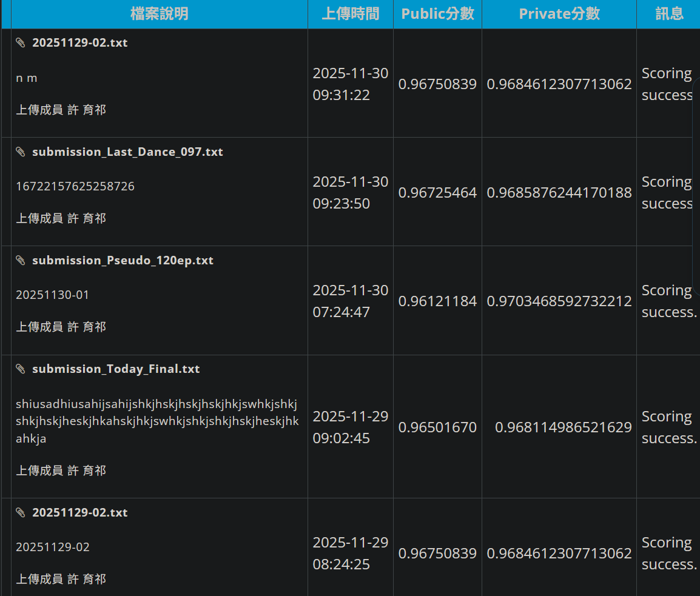

# AI CUP 2025 秋季賽：電腦斷層心臟肌肉影像分割競賽 II － 主動脈瓣物件偵測

技術報告書：模型開發與訓練策略

## 目錄

- [安裝環境](#安裝環境)
- [最終成績](#最終成績)
- [前言：關於程式碼](#前言關於程式碼)
- [1. 硬體設備與運算環境](#1-硬體設備與運算環境-hardware-environment)
- [2. 資料前處理](#2-資料前處理-data-preprocessing)
- [3. 模型選擇與架構](#3-模型選擇與架構-model-architecture)
- [4. 訓練策略與參數設定](#4-訓練策略與參數設定-training-strategy)
- [5. 推論與後處理優化](#5-推論與後處理優化-inference--post-processing)
- [6. 結論與心得](#6-結論與心得-conclusion)


## 安裝環境

- 確認已安裝 Python：[python.org](https://www.python.org/downloads/)

- 安裝 PyTorch（請依自身 CUDA 版本至官網取得對應指令）

```bash
pip install torch torchvision
```

- 安裝 Ultralytics YOLO

```bash
pip install -U ultralytics
```

接著設定資料集的 `yaml` 檔，格式如下：

```yml
path:
train:
val:
names:
  0:
```

> [!tip]
> 若採用全資料訓練（驗證集併回訓練集），設定如下：

```yml
path:
train: {path_a}
val: {path_a}   # 驗證集指回訓練集本身
test:

names:
  0:
```

## 最終成績

| Public Score | Private Score | Private 名次 | 總上傳次數 | 報告審查後最終名次 |
| :---: | :---: | :---: | :---: | :---: |
| 0.961211 | **0.970346** | **20** | 23 | **9** / 536 |

<p align="center">
  
  
</p>

> **重點：** 偽標籤（Pseudo-Labeling）策略使 Public Leaderboard 分數由 0.967 略降至 0.961，
> 但在 Private Leaderboard 上反而提升至 **0.9703**。
> 這個落差是本次競賽中最值得記錄的一件事：Public 分數的下降並不代表方法變差，
> 而是原本較高的 Public 分數有一部分來自對 Public 子集的過度適應。

---

## 前言：關於程式碼

> [!important]
> **Notice**
> This repository focuses on the source code and models required to reproduce our **best private score (0.9703)**.
> Artifacts from early-stage experiments or lower-scoring attempts are not included.
> 本專案專注於重現最佳成績（0.9703）所需的程式碼與模型；早期實驗或分數較低的嘗試檔案未全數包含於此。

1. 檔名 `train_v{x}.py` 為訓練腳本、`predict_v{x}.py` 為預測腳本，`x` 為版本編號。
2. 程式碼中寫為 `submit_{}.txt` 的輸出檔，實際執行時命名為 `{當天日期}-{當天上傳次數}.txt`。
   檔名與程式碼中的字串不同，但內容格式一致，特此說明。
3. `yolo_v9_training.py`、`fusion_v3.py` 等檔案為模型間的加權融合與答案輸出。
   這一類實驗共用同一個檔案反覆覆寫，因此部分中間版本未保留（不影響最終成績），特此說明。
4. 在 **Public** 記分板上分數最高的預測檔案為 [training_v7.py](./src/training_v7.py)；
   最終成績（Private）最高的則為 [training_v9.py](./src/training_v9.py)。

以下為完整的實驗紀錄，包含未採用與失敗的嘗試。保留這份紀錄的目的，
是讓每一個分數變化都能對應到一個具體的改動，而不只是呈現最後的結果。

> [!note]
> 👑 表示該次為當時的新高。

| 階段 | 對應檔案 | Public 約略分數 | 註記 |
|---|---|---|---|
| 官方 baseline | 無 | 0.80 | 起始基準 |
| YOLOv8L，100 epochs | training_v1.py | 0.96 👑 | |
| YOLOv8X | training_v2.py | 0.92 | 推測為資料量不足導致過擬合（未進一步驗證） |
| YOLOv8，200 epochs | training_v3.py | 0.96 👑 | |
| YOLOv8L，放大輸入影像 | training_v3.py | 0.95 | 放大影像未如預期提升精度，原因未釐清 |
| 融合 L 與 X | model_l_x_fusion.py | 0.96 | 融合後被分數較低的模型拖累 |
| 融合 L 與放大版 | model_l_l_fusion_v2.py | 0.96 | 同上 |
| YOLOv8L，150 epochs | training_v4.py | 0.96 | |
| K-fold 交叉驗證 | k-fold_v1.py | 0.96 | 效果不如預期，後續未採用 |
| YOLOv8 高精度設定 | training_v5.py | 0.95 | |
| 改用 YOLO11 | — | ❌ | RAM 不足（OOM），訓練中斷 |
| YOLO11，快取改為 disk | training_v6_fix.py | 0.965 👑 | |
| YOLO11 高精度設定 | 檔案毀損 | 0.96 | |
| 三模型融合（當時分數前三） | three_model_fusion_v3.py | 0.967 👑 | |
| YOLO11X | 檔案毀損 | 0.95 | |
| 測試 YOLOv9e | yolo_v9_training.py | 0.95 | 另含多個其他測試檔案，結果皆不佳 |
| 微調訓練集 | training_v7.py | 0.967 👑 | Public 最高 |
| 偽標籤訓練 | training_v8.py | 0.96 | **Private 最高（0.9703）**，見上方說明 |
| 二次推論融合 | final_dance.py | 0.967 | 對第一次預測結果再推論一次後融合 |

---

## 1. 硬體設備與運算環境 (Hardware Environment)

本次競賽採用 **台灣杉二號 (Taiwania 2)** 的容器運算服務 (TWCC CCS) 進行模型訓練。相較於 Google Colab，TWCC 提供更穩定且高效能的運算資源，使大規模的偽標籤訓練任務得以執行。

| 項目 (Item) | 規格與配置 (Specification) | 說明 (Description) |
| :--- | :--- | :--- |
| **運算平台** | TWCC 容器運算服務 (CCS) | 高效能運算環境 |
| **GPU** | **NVIDIA Tesla V100-SXM2-32GB** | 具備 32GB VRAM，足以支撐 YOLO11x 與 Batch Size 12 的訓練需求 |
| **CPU** | 8 Cores | 提供足夠的資料預處理與解壓縮能力 |
| **記憶體 (RAM)** | **180 GB** | 訓練初期可開啟 `cache=True` 加速，後期改用 `cache='disk'` 處理偽標籤的大量資料 |
| **作業系統** | Linux (Ubuntu) | 標準深度學習環境 |
| **軟體環境** | PyTorch 24.08、Ultralytics 8.3 | YOLO 框架與相容的 PyTorch 版本 |

---

## 2. 資料前處理 (Data Preprocessing)

針對主動脈瓣偵測任務，採取「資料清洗」與「偽標籤擴增」雙重策略，這是分數突破 0.97 的關鍵。

### A. 全資料訓練 (Full Data Training)

官方 baseline 預設將 50 位病患資料切分為 30 位訓練、20 位驗證。為提升泛化能力，將 **驗證集全部併回訓練集**，以完整的 **50 位病患資料** 進行訓練。

需要說明的是，這個做法的代價是失去了本地的驗證依據——此後只能依賴 Public Leaderboard 判斷模型好壞，而 Public 與 Private 的落差最終也證明了這個依賴是有風險的。

### B. 資料清洗 (Data Cleaning)

以初步訓練的高精度模型對官方訓練集進行反向檢查，篩選出預測與標註差異過大的樣本，再以 **labelImg** 人工校正（修正漏標與邊界框誤差）。修正後的資料使基礎分數提升至 0.9675。

### C. 偽標籤 (Pseudo-Labeling) — **關鍵策略**

面對僅有 50 位病患的訓練資料、卻有 16,620 筆測試切片的極端不平衡，採用半監督學習：

1. 以人工修正版模型對測試集進行推論。
2. 篩選信心分數 (Confidence) > **0.85** 的高可信度預測框。
3. 將這些預測作為偽標籤，與原始訓練集混合，進行第二階段的自我訓練 (Self-Training)。

此舉使訓練資料量大幅增加，提升了模型對測試集特徵的覆蓋率。

---

## 3. 模型選擇與架構 (Model Architecture)

經歷多次迭代（YOLOv8n → YOLOv8l → YOLOv9e），最終選定 **YOLO11x** 作為決戰模型。

- **最終模型：** **YOLO11x (Extra Large)**
- **選擇理由：**
    1. **架構更新**：YOLO11 的 C3k2 與 C2PSA 模組在特徵提取上優於 v8。
    2. **大模型優勢**：在 V100 32GB 的支援下，Extra Large 版本能捕捉主動脈瓣模糊邊緣的細微特徵。
    3. **適應性**：在偽標籤的大量資料下，大模型較不易過擬合，能有效吸收資料特徵。

> 事後檢討：當時 YOLOv12 已經釋出，但因剩餘上傳次數有限，最終未敢投入嘗試。
> 這是本次競賽中比較明確的一個決策失誤。

---

## 4. 訓練策略與參數設定 (Training Strategy)

| 參數 (Hyperparameter) | 設定值 (Value) | 策略說明 (Strategy Rationale) |
| :--- | :--- | :--- |
| **Epochs** | **120** | 針對偽標籤的大量資料，120 epochs 可確保收斂且避免過度擬合 |
| **Batch Size** | **12** | 針對 YOLO11x 在 V100 上的記憶體上限進行最佳化 |
| **Optimizer** | **Auto (SGD)** | 配合 `cos_lr=True`（餘弦退火），確保訓練後期穩定收斂 |
| **Close Mosaic** | **15** | 最後 15 個 epochs 關閉馬賽克增強，讓模型專注於真實影像的特徵 |
| **Cache** | **Disk** | 加入偽標籤後資料量大增，改用硬碟快取避免 RAM OOM |
| **Workers** | **2** | 適度增加 workers 以加速資料讀取 |

---

## 5. 推論與後處理優化 (Inference & Post-processing)

最終提交階段放棄單純的模型融合 (WBF)，改採單一模型的推論優化策略：

1. **測試時增強 (TTA)：** 開啟 `augment=True`，預測時自動進行多尺度縮放與翻轉並融合結果，提升邊緣偵測的穩定性。
2. **串流預測 (Streaming)：** 設定 `stream=True`，以生成器模式處理 16,620 張測試影像，避免記憶體溢出。
3. **非極大值抑制 (NMS) 微調：**
   - **Confidence Threshold：** 設為極低的 **0.001**，確保高 Recall（不漏抓）。
   - **IoU Threshold：** 調整至 **0.65**，優化重疊框的合併效果。

---

## 6. 結論與心得 (Conclusion)

本次競賽由 baseline 的 0.80 一路提升至 0.97+，最直接的體會是 **「資料品質的影響大於模型架構」**。

* **關鍵轉折一：資料清洗**
  修正官方標註錯誤後，分數由 0.965 提升至 0.9675，說明乾淨資料的重要性。

* **關鍵轉折二：偽標籤**
  引入偽標籤後 Public Score 微幅下降至 0.961，Private Score 卻提升至 **0.9703**。
  在小樣本的醫療影像任務中，利用大量無標註測試資料進行半監督學習，是提升泛化能力最有效的手段之一。

* **最重要的一課：Public 分數不等於方法的好壞**
  把驗證集併回訓練集之後，Public Leaderboard 成為唯一的判斷依據，而它衡量的只是測試集的一個子集。
  偽標籤讓 Public 下降、Private 上升，正好說明先前較高的 Public 分數有一部分來自對該子集的過度適應。
  在沒有可靠保留資料的情況下，任何「分數變高了」的結論都應該保留懷疑。

最終方案為 **YOLO11x + 人工清洗資料 + 偽標籤自我訓練**。
